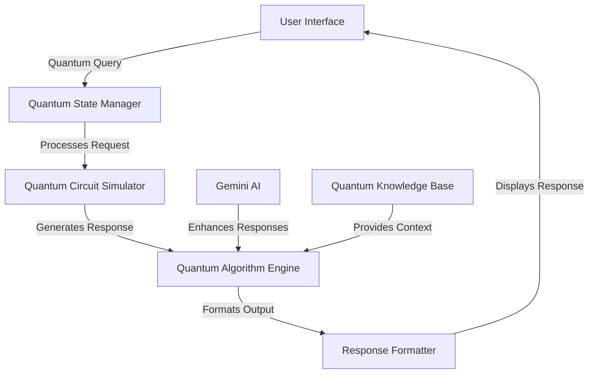

# 🌌 Quantum Computing Learning Assistant

An interactive educational platform for exploring the fascinating world of quantum computing. This application combines modern web technologies with Google's Gemini AI to create an engaging learning experience about quantum mechanics and quantum information science.


## 🎯 Why Quantum Computing?

Quantum computing represents a paradigm shift from classical computing, leveraging the principles of quantum mechanics to solve complex problems that are intractable for traditional computers. This project serves as an educational gateway to understanding:

- **Qubits vs Classical Bits**: Explore how quantum bits can exist in superposition
- **Quantum Entanglement**: Understand spooky action at a distance
- **Quantum Algorithms**: Learn about Shor's, Grover's, and other quantum algorithms
- **Quantum Applications**: Discover real-world use cases in cryptography, optimization, and material science

## 🌟 Quantum Learning Features

### Core Quantum Concepts
- **Qubit Explorer**: Visualize quantum states and superpositions
- **Quantum Gates**: Interactive demonstrations of Hadamard, Pauli-X/Y/Z, and other quantum gates
- **Entanglement Simulator**: Understand quantum entanglement through interactive examples
- **Quantum Algorithms**: Learn about Shor's, Grover's, and other quantum algorithms

### Interactive Learning
- **Real-time Q&A**: Get instant explanations about quantum computing concepts
- **Quantum Circuit Builder**: Visual tool to create and test quantum circuits (coming soon)
- **Math Rendering**: Beautiful LaTeX rendering for quantum equations and formulas
- **Code Examples**: Run and modify quantum code snippets in various frameworks (Qiskit, Cirq, etc.)

### Educational Resources
- **Topic Library**: Curated collection of quantum computing topics
- **Learning Paths**: Structured guides from quantum basics to advanced concepts
- **Visual Aids**: Interactive Bloch spheres and quantum circuit diagrams
- **Historical Context**: Learn about key milestones in quantum computing history

## 🛠️ Quantum Architecture



### Quantum Components

1. **Quantum State Manager**
   - Handles qubit states and superpositions
   - Manages quantum entanglement between components
   - Implements quantum error correction

2. **Quantum Circuit Simulator**
   - Simulates quantum gate operations
   - Visualizes quantum circuits
   - Calculates quantum state probabilities

3. **Quantum Algorithm Engine**
   - Implements core quantum algorithms
   - Optimizes quantum circuits
   - Handles quantum-classical hybrid computations

4. **Quantum Knowledge Base**
   - Curated database of quantum concepts
   - Quantum algorithm implementations
   - Educational resources and examples

### Classical Components

1. **User Interface**
   - React-based responsive design
   - Interactive quantum visualizations
   - Real-time chat interface

2. **API Services**
   - Manages communication with quantum backends
   - Handles authentication and rate limiting
   - Caches frequently accessed quantum states

3. **State Management**
   - Tracks user progress
   - Manages quantum circuit states
   - Handles application configuration

## 🚀 Quantum Development Setup

### Prerequisites

- **Node.js** (v18 or later) - Our quantum-classical interface
- **npm** or **yarn** - For managing quantum dependencies
- **Google Gemini API key** - Powers the quantum knowledge engine
- **Python 3.8+** (optional) - For running quantum simulations locally
- **Jupyter Notebook** (recommended) - For experimenting with quantum circuits

### Quantum Environment Setup

1. **Clone the Quantum Repository**
   ```bash
   git clone [your-repository-url]
   cd quantum-learning-lab
   ```

2. **Install Quantum Dependencies**
   ```bash
   # Install JavaScript dependencies
   npm install
   
   # Optional: Set up Python virtual environment for quantum simulations
   python -m venv .venv
   source .venv/bin/activate  # On Windows: .venv\Scripts\activate
   pip install qiskit cirq qsimcirq
   ```

3. **Configure Quantum Backend**
   Create a `.env` file with your quantum computing credentials:
   ```env
   # Google Gemini for quantum knowledge
   VITE_GEMINI_API_KEY=your_gemini_api_key
   
   # Optional: IBM Quantum Experience credentials
   QISKIT_IBM_TOKEN=your_ibm_quantum_token
   
   # Optional: Google Quantum Computing Service
   GOOGLE_APPLICATION_CREDENTIALS=path/to/your/credentials.json
   ```

4. **Start the Quantum Development Server**
   ```bash
   # Start the frontend
   npm run dev
   
   # In a separate terminal, start the quantum simulation server (optional)
   python -m http.server 8001
   ```

5. **Access the Quantum Interface**
   - Frontend: [http://localhost:5173](http://localhost:5173)
   - Quantum Simulator (if enabled): [http://localhost:8001](http://localhost:8001)

## 🌟 Quantum Learning Paths

### Beginner's Quantum Journey
1. **Qubit Fundamentals**
   - Understand quantum states and superpositions
   - Explore the Bloch sphere visualization
   - Practice basic quantum measurements

2. **Quantum Gates & Circuits**
   - Learn about single-qubit gates (X, Y, Z, H, S, T)
   - Experiment with multi-qubit operations (CNOT, SWAP)
   - Build and simulate simple quantum circuits

3. **Quantum Algorithms**
   - Grover's Search Algorithm
   - Shor's Factoring Algorithm
   - Quantum Fourier Transform
   - Quantum Phase Estimation

### Interactive Features

#### 🎮 Quantum Playground
- Drag-and-drop quantum circuit builder
- Real-time simulation of quantum states
- Visualize qubit entanglement and superposition

#### 🔬 Quantum Experiments
- Double-slit experiment simulator
- Quantum teleportation demonstration
- Bell state preparation and measurement

#### 📊 Learning Resources
- Interactive tutorials with embedded quantum simulators
- Step-by-step guides with visual aids
- Challenge problems with solutions

### Advanced Topics
- Quantum Error Correction
- Quantum Machine Learning
- Quantum Cryptography
- Quantum Chemistry Simulations
- Quantum Supremacy Demonstrations

## 🧪 Quantum Testing Framework

### Running Tests

```bash
# Run all tests
npm test

# Run quantum circuit tests only
npm test -- --testPathPattern=quantum

# Run with coverage report
npm test -- --coverage
```

### Test Categories

#### 1. Quantum Unit Tests
- **Qubit Operations**: Verify correct behavior of quantum gates
- **State Preparation**: Test initialization of quantum states
- **Measurement**: Validate quantum measurement outcomes

#### 2. Algorithm Verification
- Test quantum algorithm implementations against known results
- Verify quantum circuit equivalence
- Validate quantum error correction codes

#### 3. Integration Testing
- Test quantum-classical hybrid workflows
- Verify API interactions with quantum simulators
- Validate state management across quantum operations

#### 4. Performance Benchmarks
- Measure quantum circuit execution time
- Benchmark state vector simulations
- Test quantum circuit optimization passes

### Example Test Case

```javascript
describe('Quantum Fourier Transform', () => {
  it('should correctly transform |0⟩ state', () => {
    const qc = new QuantumCircuit(1);
    qc.h(0);
    const result = qc.simulate();
    expect(result.probabilities()).toEqual([0.5, 0.5]);
  });
});
```

## 🚀 Deployment

Build the app for production:
```bash
npm run build
```

## 🤝 Contributing

1. Fork the repository
2. Create your feature branch (`git checkout -b feature/AmazingFeature`)
3. Commit your changes (`git commit -m 'Add some AmazingFeature'`)
4. Push to the branch (`git push origin feature/AmazingFeature`)
5. Open a Pull Request

## 📄 License

This project is licensed under the MIT License - see the [LICENSE](LICENSE) file for details.

## 🙏 Acknowledgments

- Google Gemini AI for the powerful language model
- React and Tailwind CSS for the amazing UI framework
- The quantum computing community for their valuable resources

---

<div align="center">
  Made with ❤️ for quantum enthusiasts
</div>
